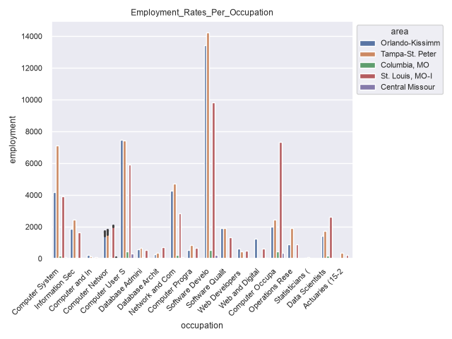
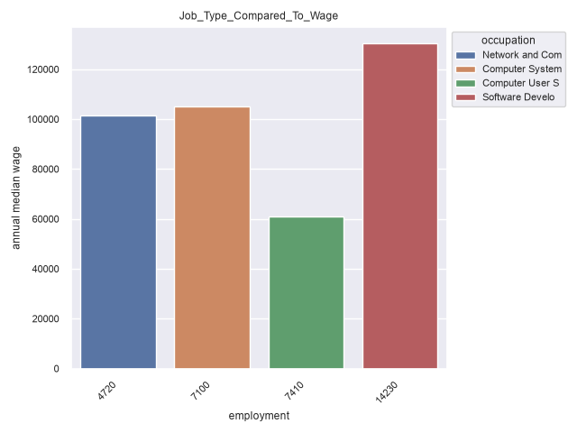
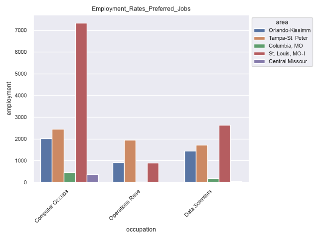
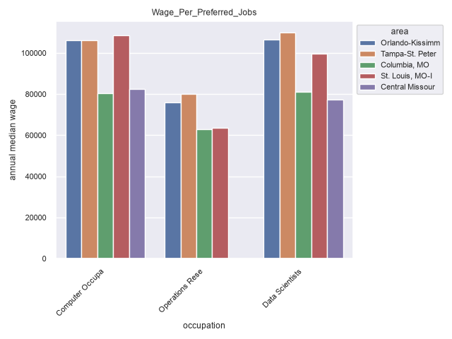
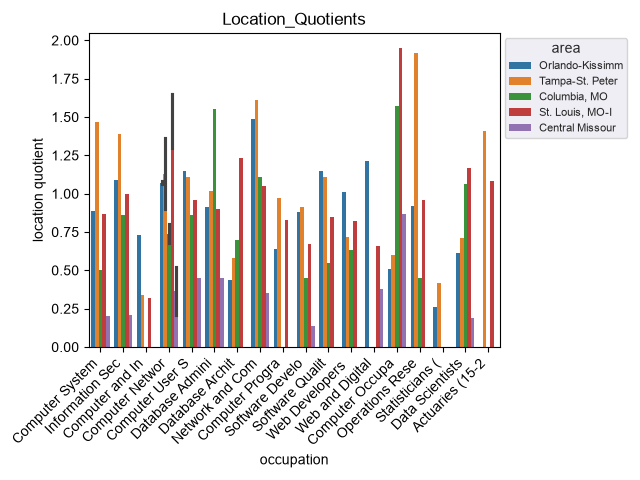

# Project Documentation

This site provides project documentation.

## Custom Project

### Basis

I obtained Occupational Employment and Wage Statistics from [U.S. Bureau of Labor Statistics](https://data.bls.gov/oes/#/home)
I selected 4 areas, Midwest Missouri, St. Louis, greater Orlando area, and greater Tampa area. I filtered this by all occupations in the "computer and mathematical" domain (see table below) and obtained Employment (# of people employed in that occupation), Median and Mean Wage, and also the Location Quotient, where a value of 1 means job availability is similar to the national average and values nearing 0 have less jobs available in that domain.

| Occupation Category            | Job Title                                       |
| :----------------------------- | :---------------------------------------------- |
| **Development & Design** | Software Developers                             |
|                                | Software Quality Assurance Analysts and Testers |
|                                | Web Developers                                  |
|                                | Web and Digital Interface Designers             |
|                                | Computer Programmers                            |
| **Data & Databases**     | Data Scientists                                 |
|                                | Database Administrators                         |
|                                | Database Architects                             |
| **Systems & Security**   | Information Security Analysts                   |
|                                | Computer Systems Analysts                       |
|                                | Computer and Information Research Scientists    |
| **Networks & Support**   | Computer Network Architects                     |
|                                | Computer Network Support Specialists            |
|                                | Computer User Support Specialists               |
|                                | Network and Computer Systems Administrators     |
| **Math & Analytics**     | Actuaries                                       |
|                                | Operations Research Analysts                    |
|                                | Statisticians                                   |
| **Other**                | Computer Occupations, All Other                 |

### Phase 4 Modifications

I first began by importing the instructor's template python file as a module into my new python file. This was somewhat helpful, but I realized I'd need to edit several of the functions to adapt to my custom project.

### Phase 5 Custom Project

TODO:
The purpose of this project was to compare job availability and median wage in 4 differing prospective areas to move to (current location, central missouri was included for reference). Histograms colored by area were the most useful for this purpose.

**If we look at jobs overall, Tampa and Orlando seem to have the most jobs available**

**The pay also seems to be higher (comparison of cost of living should be added in the future)**

***However it's important to note that the majority of these jobs don't line up with my experience or preferences. So I narrowed the comparison to 3 occupations. Data Scientists, Operations Research Analysts, and Computer Occupations, All Other.***

** The largest sector for data scientists is in St. Louis

An overview of the location quotient confirms central missouri isn't a great place to try to work in the tech sector

Many of the course principles were applied in this project, data extraction and cleaning, discerning correlations, and using charts to communicate findings.
